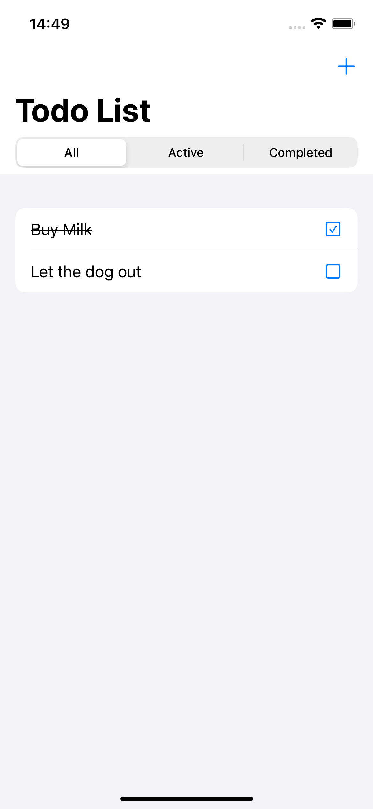

# ViewInspector-TodoList-Example

A practical SwiftUI Todo List app showcasing **ViewInspector** for fast, robust, and production-safe unit testing of SwiftUI views.

---

## 🚀 What is this?

This repository demonstrates:

- How to unit test SwiftUI view structure and logic **without modifying production code**
- Using [ViewInspector](https://github.com/nalexn/ViewInspector) for rapid, reliable feedback on your SwiftUI components

---

## 🖼️ Screenshot

<p align="center">
  
</p>

---


## 📝 Features

- **SwiftUI Todo List** app with filtering, marking complete, and add-new-item features
- Example tests that:
  - Verify correct rendering of items and completed state
  - Assert alert presentation and buttons
  - Test structural and visual changes by inspecting the view hierarchy (no simulator needed!)
- All tests run at **unit-test speed**—no need for simulator, accessibility identifiers, or production code changes

---

## 📂 Key Files

- `TodoListView.swift` – SwiftUI implementation of the Todo List
- `TodoListViewModel.swift` – ViewModel managing all business logic (not shown here, but typically simple)
- `TodoListViewTests.swift` – Unit tests using ViewInspector

---

## ✅ Sample Test Example

```swift
func testListRendersCorrectRows() throws {
    let vm = TodoListViewModel()
    vm.add(title: "Task A")
    vm.add(title: "Task B")
    let view = TodoListView(viewModel: vm)
    let list = try view.inspect().navigationStack().vStack().list(1)
    let rows = list.findAll(ViewType.HStack.self)
    XCTAssertEqual(rows.count, 2)
    let firstRow = rows[0]
    XCTAssertEqual(try firstRow.text(0).string(), "Task A")
}
```

---

## 🤔 Why ViewInspector?

- Test UI logic *at the speed of unit tests*
- No need for UI test flakiness or CI headaches
- Most common SwiftUI APIs and modifiers are supported ([readiness list](https://github.com/nalexn/ViewInspector/blob/0.10.3/readiness.md))

---

## 📚 Further Reading

- [ViewInspector Docs](https://github.com/nalexn/ViewInspector)
- [ViewInspector Readiness List](https://github.com/nalexn/ViewInspector/blob/0.10.3/readiness.md)


